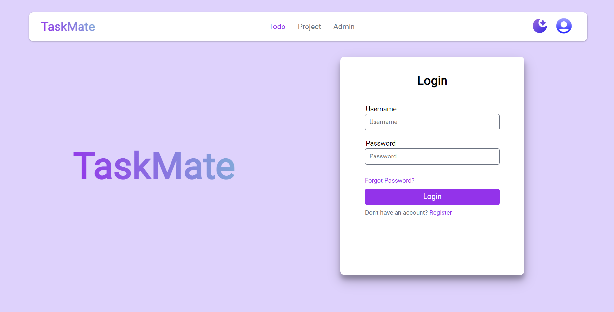
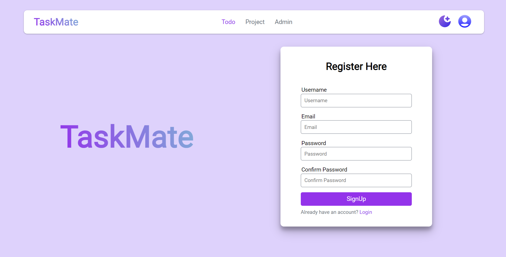
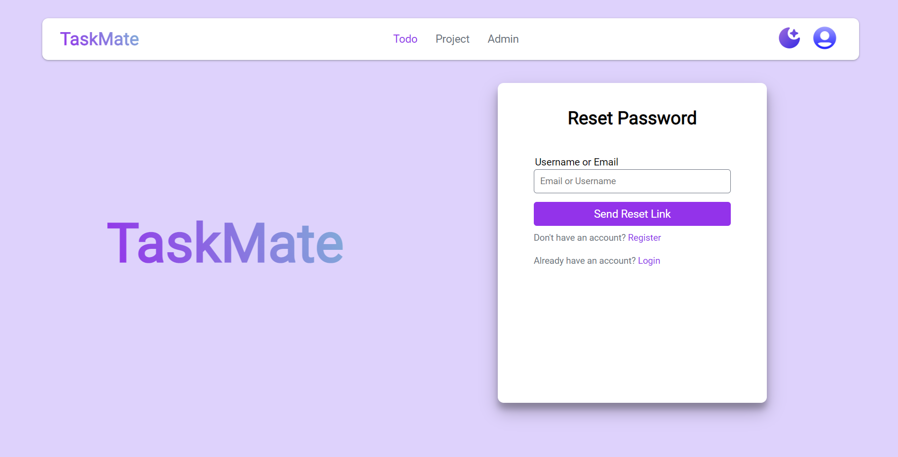
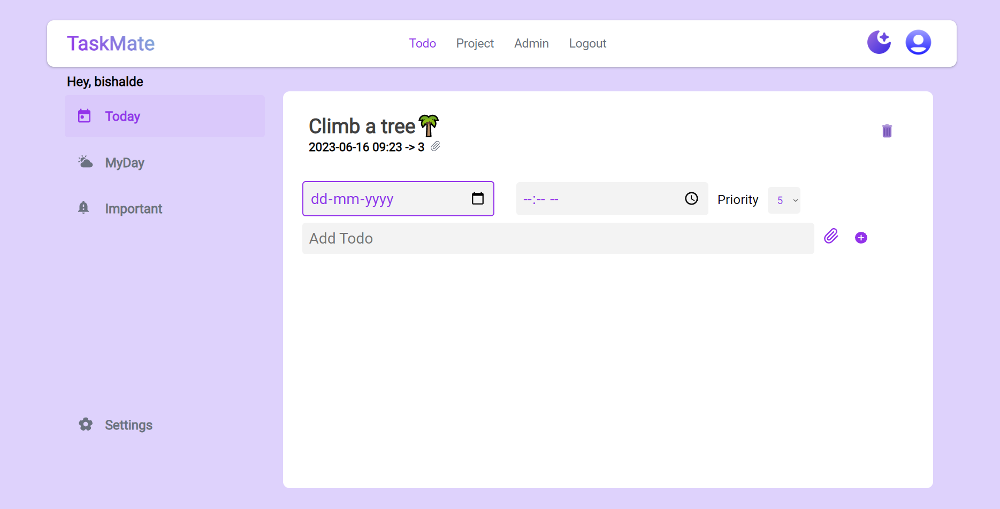
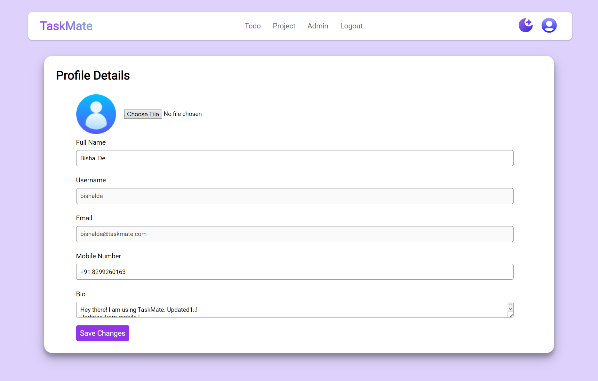

<h1 align="center">
   
  Unlock Your Productivity with Our Online To-Do Powerhouse! 
  <a href="https://taskmatee.vercel.app" target=""_blank>https://taskmatee.vercel.app</a>
</h1>

&nbsp;&nbsp;&nbsp;&nbsp;&nbsp;&nbsp;

## Repo Status ✳️

 
	
	
	
 
 
	
	
	
	

 

## Description 🌵

##### Introducing TaskMate: Your Ultimate Task Management Companion

TaskMate is a feature-rich to-do website designed to revolutionize the way you manage and accomplish your tasks. Built on the robust Django framework and powered by MongoDB, TaskMate offers a seamless and efficient experience for individuals and teams looking to stay organized and boost productivity.

With TaskMate, you can effortlessly create, organize, and prioritize your tasks, ensuring that nothing falls through the cracks. The intuitive and user-friendly interface allows you to easily navigate through various task categories, set due dates, assign tags, and add detailed descriptions to ensure clarity and context.

One of the standout features of TaskMate is its seamless integration with MongoDB, a highly scalable and flexible NoSQL database. This integration ensures optimal performance, data security, and allows for effortless synchronization across multiple devices, keeping your tasks up to date, whether you're at home, in the office, or on the go

## Features 😱
- User registration and authentication.
- Ability for users to create, read, update and delete tasks.
- Live previews
- Task categories and priority levels.
- Fullscreen mode
- Cross platform

## Screenshots 📷

##### Login Page

##### SignUp Page

##### Reaset Passowrd Page

##### Home Page

##### Edit Task Page

##### Profile Page

## Contribution Steps

## Social Links 🔗

&nbsp;
&nbsp;
&nbsp;
&nbsp; 
&nbsp;
&nbsp;
&nbsp;

## Give Me A Bow 🏹

&nbsp;
&nbsp;

## Our Contributors ✨

 
  
Thank you to all the amazing contributors who have made this project possible!!💝