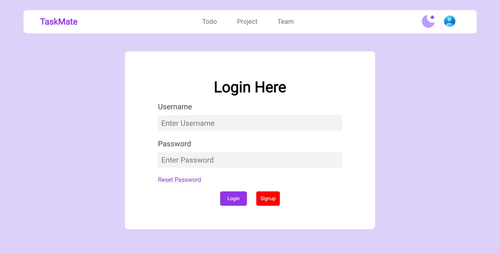
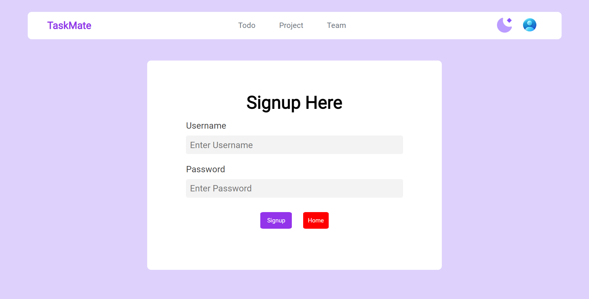
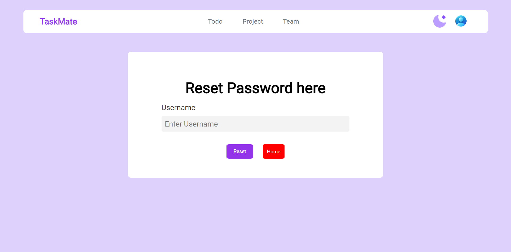
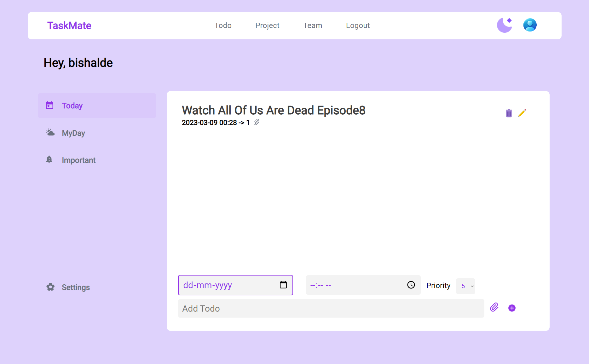
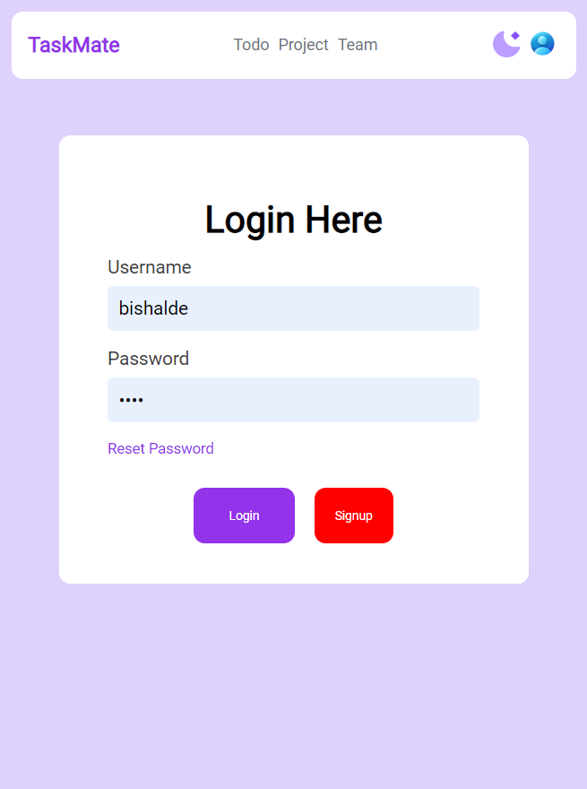
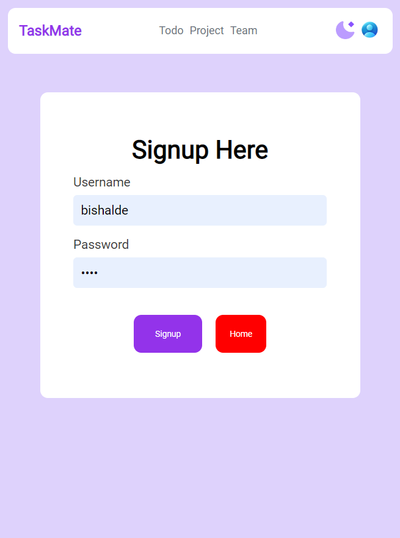
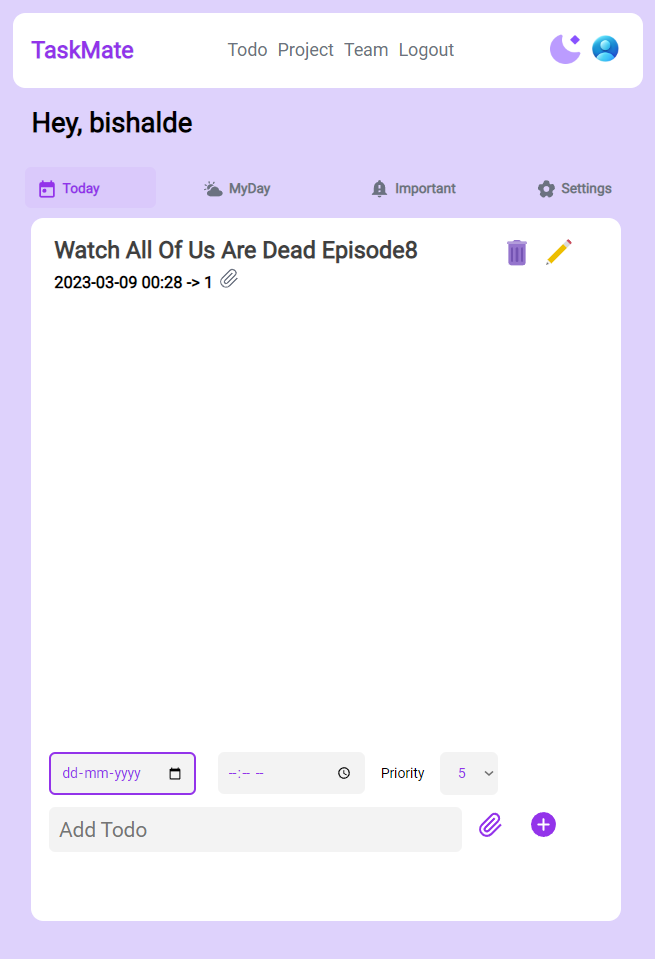

# TaskMate - TODO App using Flask

A TODO App is a popular application that is used to track tasks or activities that need to be completed. The app can help people manage their scheduled tasks and increase productivity.

## Features

The TODO app built with Flask will have the following features:

- User registration and authentication.
- Ability for users to create, read, update and delete tasks.
- Live previews
- Task categories and priority levels.
- Fullscreen mode
- Cross platform

## Website

TaskMate - https://taskmate-yo5n.onrender.com

The Website Is Perfectly Working..!
`Since, It uses free MySQL Service so sometime it could not connect to the server. Refresh the Page Multiple times or Try again later..`

#### To run on local MySQL

Download the Git repository and change the App.py

```sh
mydb = mysql.connector.connect(
  host="localhost",
  user="yourusername",
  password="yourpassword"
)
```

### To Run The App.py

Type this in terminal

```sh
.\Scripts\activate
pip install -r requirements.txt 
python APP.py  
```

## Tech Stack

**Client:** Html , CSS , JS

**Server:** MySQL , Python-Flask

## Screenshots









# Developer

- [@Bishalde](https://www.github.com/BishalDe)

# 🔗 Links

[](https://bishalde.github.io/)

[](https://www.linkedin.com/in/bishalde/)

[](https://instagram.com/bishal_de)

# Support

For support, email bishalde208@yahoo.com or join our call +91-8299260163.
